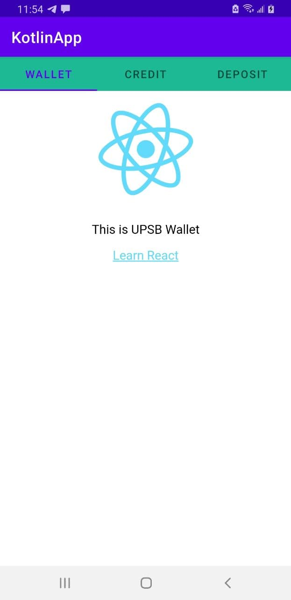
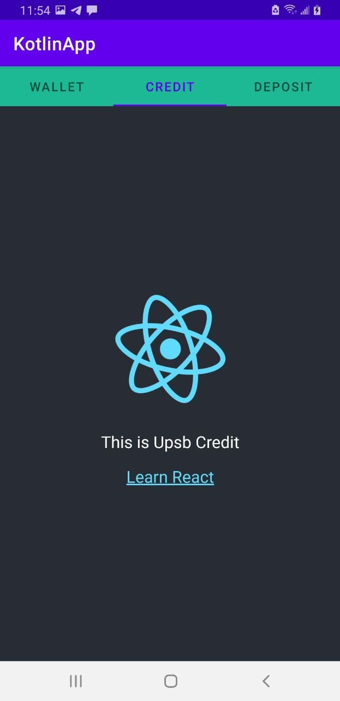
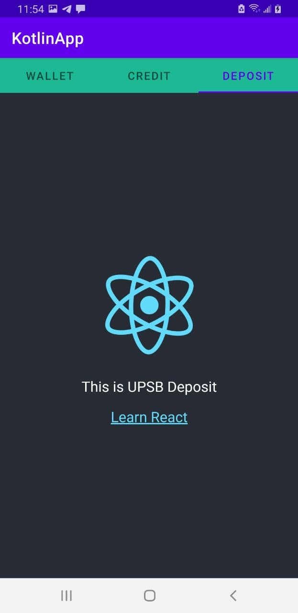

# Mobile Microservice Application for Hackaton DEV-HACK
It is the Kotlin Mobile Application which is main core native application for combine all microfronts. And here the react microfronts will render via webview in Kotlin application. You may think that this will take a long time to load and it will the bad way, In theory, No!, if you will configure caching correctly, the application will work fastly, and without any loads. And it will be impossible to notice that there has webview.

# :building_construction: Demo
You can download apk for android, and test it. 

| Package                                                  | Description                                        | Demo | Status                                                                                                                                                                                                                                                                                                                                                                                                                      |
| -------------------------------------------------------- | ----------------------------- | --------------------------------------- | --------------------------------------------------------------------------------------------------------------------------------------------------------------------------------------------------------------------------------------------------------------------------------------------------------------------------------------------------------------------------------------------------------------------- 
| [:dollar: UPSB Wallet](https://github.com/samakovuluk/upsb-wallet)             | Microfontend UPSB Wallet | [wallet.upsb.xyz](https://wallet.upsb.xyz) |             |
| [:credit_card: UPSB Credit](https://github.com/samakovuluk/upsb-credit)         | Microfrontend UPSB Credit | [credit.upsb.xyz](https://credit.upsb.xyz) |                 |
| [:moneybag: UPSB Deposit](https://github.com/samakovuluk/upsb-deposit)     | Microfrontend UPSB Deposit | [deposit.upsb.xyz](https://deposit.upsb.xyz) |                |

# :iphone: Microservice application with Kotlin and React

# :framed_picture: Screenshots

&nbsp;&nbsp;&nbsp;&nbsp;&nbsp;&nbsp;

## :gift_heart: Сollaborators
The project UPSB is created by these developers.
<!-- prettier-ignore -->
<table>
  <tr>
    <td align="center"><a href="https://github.com/samakovuluk"> <b>Samakov Ulukbek</b>
      </a>
     
      
Software Engineer

      <a href="https://www.linkedin.com/in/ulukbek-samakov/"> 
      </a>
    </td>
    <td align="center"><a href="https://github.com/akimberl"> <b>Burbu </b></a>
       
     
Frontend Developer

      <a href="https://www.linkedin.com/in/burbu-kuular-67013310a/"> 
      </a>
    </td>
    <td align="center"><a href="https://github.com/arishonochek"> <b>Arina </b></a>
           
     
Ui/Ux Designer

      <a href="https://www.linkedin.com/in/"> 
      </a>
    </td>
  </tr>
  
</table>

